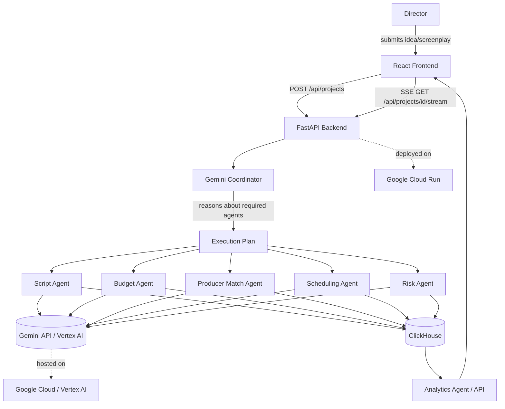

# CineFlow AI — Architecture

## System flow

## Where each required technology is actually used

| Requirement | Where |
|---|---|
| **Gemini** | `backend/app/services/gemini_service.py` — real `google-genai` SDK calls with `response_mime_type=application/json`, used by `CoordinatorAgent` and `ScriptAgent` (Budget/Producer/Scheduling/Risk agents follow the same pattern, see Build Status). |
| **ClickHouse (partner tech)** | `backend/app/services/clickhouse_service.py` — real `clickhouse-connect` client. Writes: `projects`, `agent_runs`. Reads: `/api/analytics/*` endpoints run genuine `SELECT`/`JOIN`/`GROUP BY` queries. |
| **Google Cloud** | Deployment target is Cloud Run (`backend/Dockerfile`); Gemini access can go through Vertex AI (`USE_VERTEX_AI=true`) instead of a raw API key, which is the Cloud-native auth path; secrets belong in Secret Manager, not `.env`, once deployed. |
| **Multi-step deterministic agent workflow** | `CoordinatorAgent.build_execution_plan` produces an explicit dependency graph; `routes_projects.stream_execution` walks it in order and streams real `AgentEvent`s over SSE — no `setTimeout` simulation. |

## Build status (honest, as of this repo snapshot)

Implemented and tested:
- Gemini Coordinator (dynamic execution planning)
- Script Agent (structured screenplay/idea analysis)
- Real-time SSE agent execution stream with retry/failure handling
- ClickHouse schema + service layer + 2 analytics endpoints
- Real JWT auth (register/login), SQLite-backed users/projects/activity
- Producer marketplace: real filterable directory (12 seeded producers), real "Connect" action that creates a ProducerConnection row and logs to the activity feed — no hardcoded producer list or fake button
- Real per-user activity log, surfaced live on the dashboard
- AI Studio page renders live from actual SSE events — agents that haven't been built yet show an honest "Not Implemented" status instead of a fake "Done"
- Unit tests for Coordinator + Script Agent (agent logic, not Gemini itself)

Not yet implemented (planned, next phases — see README "Roadmap"):
- Budget Agent, Scheduling Agent, Risk Agent, Analytics Agent (the Coordinator plans for them; the pipeline honestly reports them as skipped)
- Investment workflow beyond the initial connection request (accept/decline, meeting scheduling, offers)
- React frontend (currently the original static HTML prototype)
- Firebase Auth, Cloud Run deployment configs beyond the Dockerfile
- Pitch deck generator, PDF export

The Coordinator will happily *plan* for these agents (it doesn't know they're
unbuilt) — `routes_projects.py` checks a `_IMPLEMENTED_AGENTS` registry and
emits an honest `skipped` SSE event for anything not yet built, rather than
faking their output. This is intentional: the frontend should show real
build status, not a fully green pipeline that isn't real yet.
